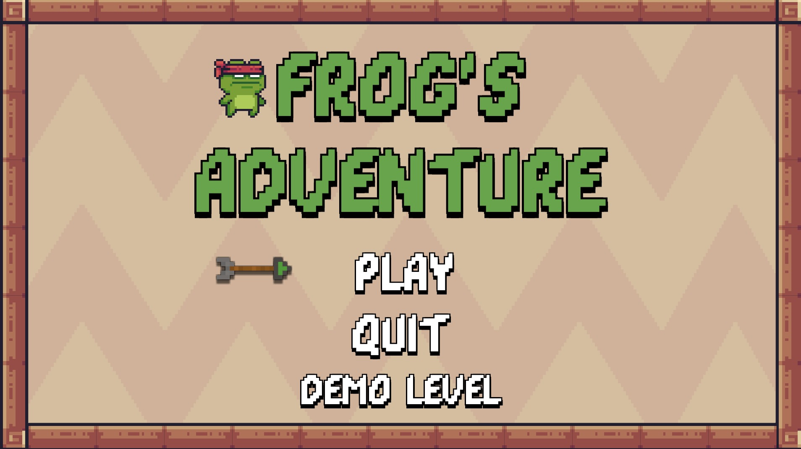
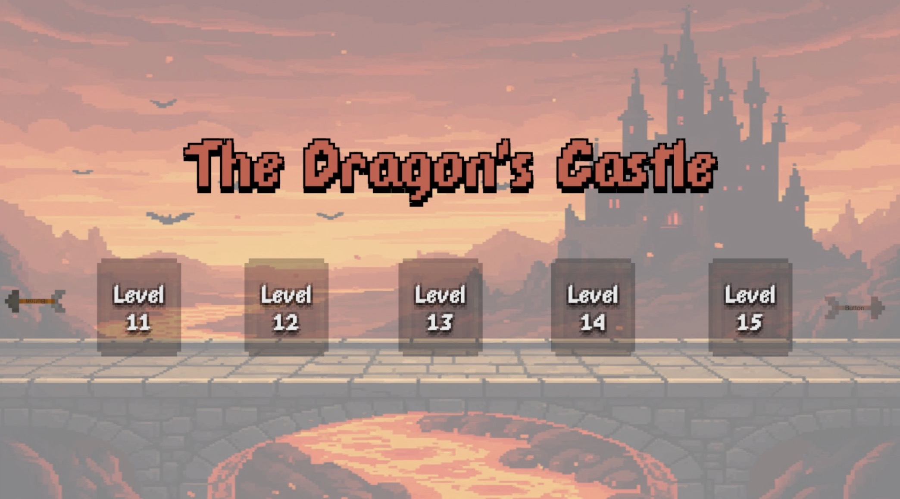
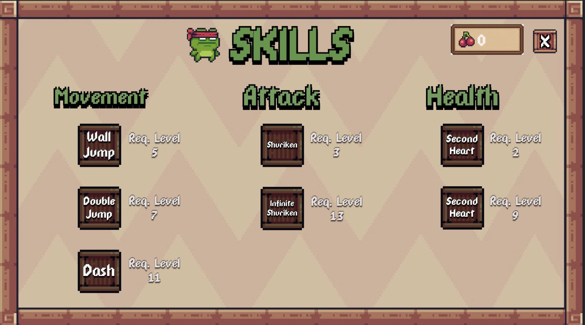
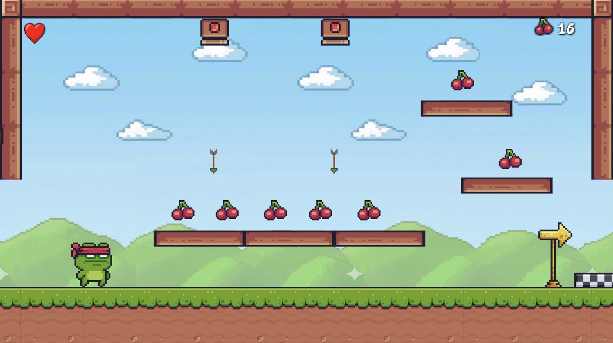

# 🐸 Frog's Adventure

> **A Pixel-Art Action Platformer developed in Unity.**
> *Jump, Dash, and Morph to save the Lilypad Kingdom!*

## 🚧 Project Status: Work in Progress (WIP)
**Current State:** Development / Portfolio Project
* **Content:** 3 Playable Levels (World 1) + 1 Special Demo Level.
* **Goal:** This project is currently in active development. The "Demo Level" is designed to showcase all unlockable mechanics immediately.

---

## 📖 About The Game

<table>
  <tr>
    <td width="70%" valign="top">
      <h3>The Story & Gameplay</h3>
      <p>
        <strong>Frog's Adventure</strong> is a 2D side-scrolling platformer where players control <strong>Frobert</strong>, a brave frog on a quest to rescue <strong>Princess Lily</strong> from the evil <strong>Dragon Lord Drako</strong>.
      </p>
      <p>
        Unlike typical platformers, Frobert evolves throughout the journey. Starting with a simple jump, players collect <strong>Cherries</strong> 🍒 to buy permanent upgrades from a <strong>Skill Tree</strong> and use magical <strong>Fruit Power-Ups</strong> to solve environmental puzzles.
      </p>
      <p>
        <em>But rumors say Frobert is no ordinary frog... hidden <strong>Pineapples</strong> 🍍 scattered across the world might reveal his true form!</em>
      </p>
    </td>
    <td width="30%" valign="top">
      
    </td>
  </tr>
</table>

---

## 🎥 Gameplay Showcase

### Main Gameplay
[](https://www.youtube.com/watch?v=6Ye4q9SZL-A)

### Demo Level (Features Showcase)
[](https://www.youtube.com/watch?v=6Ye4q9SZL-A)

---

## 🎮 Gameplay Features

### ⚔️ Progression & Skills ("The Frog's Path")
Managed via `GameManager.cs`, players use collected Cherries to unlock abilities permanently:
* **Wall Jump & Double Jump:** Access new heights.
* **Dash:** Dodge attacks and cross wide gaps.
* **Shuriken Mastery:** Unlock ranged combat (Finite or Infinite ammo).
* **Extra Health:** Survive longer against bosses.

### 🍌 Puzzle-Solving Power-Ups
Temporary abilities (handled by `PlayerPowerUps.cs`) add a puzzle layer to the platforming:
* **Banana (Shrink):** 🍌 Shrink down to fit into tiny tunnels.
* **Strawberry (Invisibility):** 🍓 Bypass security cameras and enemies.
* **Kiwi (Magnet):** 🥝 Attract all nearby collectibles automatically.
* **Watermelon (Heavy Weight):** 🍉 Smash through cracked floors and activate heavy pressure plates.

### 🏆 The "True Ending" Secret
A unique mechanic for completionists:
* Find all **9 Hidden Pineapples** throughout the game.
* Unlock the secret door at the start.
* *Completing the game with all pineapples triggers a special cutscene revealing Frobert's human prince form!* 🤴

---

## 📸 Screenshots

| **Main Menu** | **Level Select Menu** |
|:---:|:---:|
|  |  |
| *The gateway to the adventure* | *Choose your path across 3 Worlds* |

| **Skill Tree System** | **Level Example** |
|:---:|:---:|
|  |  |
| *Upgrade Frobert's abilities with Cherries* | *Action-packed platforming in World 1* |

---

## 🛠️ Technical Implementation

This project demonstrates solid **Object-Oriented Programming (OOP)** principles and Unity best practices:

* **Singleton Pattern:** Used in `GameManager`, `SoundManager`, and `UIManager` for centralized global access to game state and audio.
* **Save/Load System:** Utilizing `PlayerPrefs` to persist Skill Tree unlocks, collected Pineapples (`PineappleCollectible.cs`), and high scores between sessions.
* **Coroutines:** Extensively used for timed Power-Up effects (e.g., `BananaRoutine` inside `PlayerPowerUps.cs`) and smooth UI transitions.
* **Object Pooling:** Implemented for projectiles (`Projectile.cs`) and traps (`ArrowTrap.cs`) to minimize garbage collection and improve performance.
* **Finite State Logic:** Player states (Idle, Run, Jump, Fall, Attack) are managed via Animator parameters driven by `PlayerMovement.cs`.

---

## 💻 How to Run the Project

Since the game is currently in development, there is no pre-built `.exe` file. You can run the project directly in the Unity Editor:

1.  **Clone the Repository:**
    ```bash
    git clone [https://github.com/batusalcan/Frogs-Adventure-Game.git](https://github.com/batusalcan/Frogs-Adventure-Game.git)
    ```
2.  **Open in Unity:**
    * Launch **Unity Hub**.
    * Click **"Add"** and select the cloned project folder.
    * Open the project (Recommended Unity Version: **2022.3 LTS** or newer).
3.  **Play:**
    * Go to `Assets/Scenes`.
    * Open **"MainMenu"** scene.
    * Press the **Play** button at the top.
    * *Tip: You can also open "DemoLevel" to test all abilities instantly.*

---

## 🕹️ Controls

| Key | Action |
| :--- | :--- |
| **A / D** (or Arrows) | Move Left / Right |
| **W / Space** | Jump (Hold for higher jump) |
| **Left Shift** | Dash (Unlockable) |
| **Mouse Left Click** | Shuriken Attack (Unlockable) |
| **ESC** | Pause Menu |

---

## 👨‍💻 Credits

**Developer:** Batuhan Salcan  
**Engine:** Unity (C#)  
**Art Assets:** Pixel Adventure (Unity Asset Store)

---

*Thank you for visiting my portfolio project!*

## 📂 Documentation
If you want to dive deeper into the design and development process, check out the documents included in this repo:
* 📄 **[Game Design Document (PDF)](Docs/GameDesignDocument.pdf):** Detailed mechanics, story, and systems.
* 📊 **[Project Presentation (PDF)](Docs/FrogsAdventurePresentation.pdf):** A visual summary of the game's features and art.
* *(Note: If preview fails, please download to view)*

---
